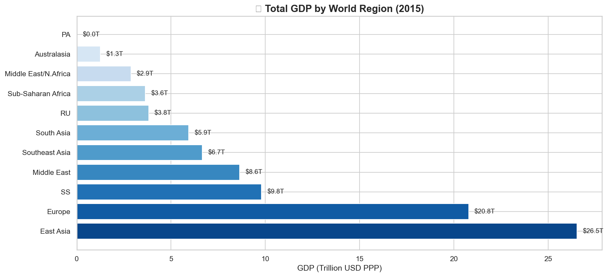
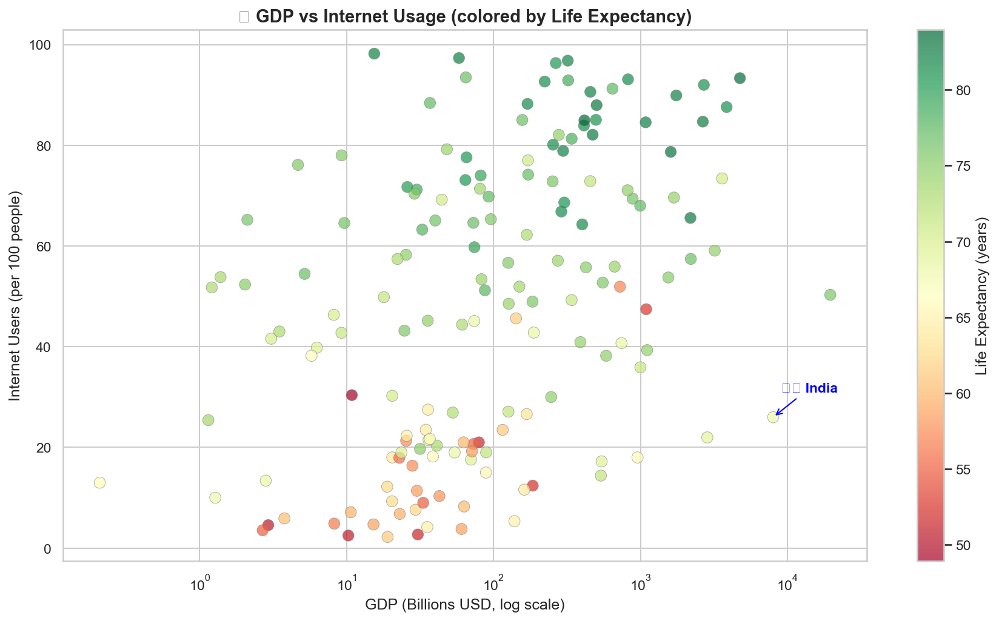
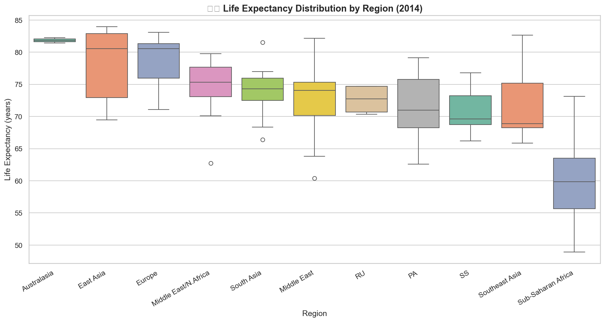
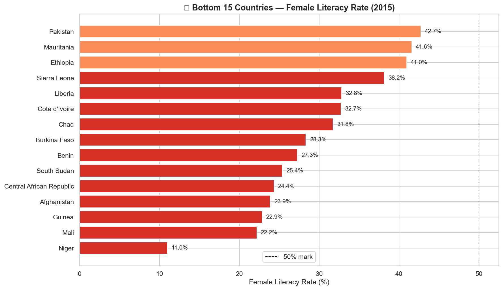
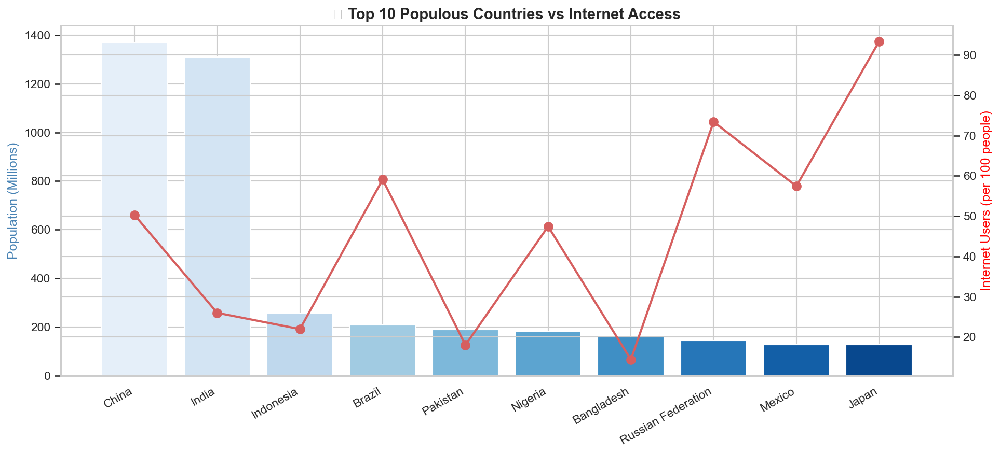
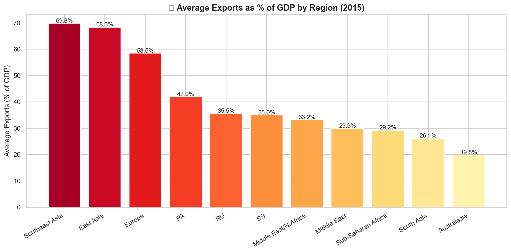
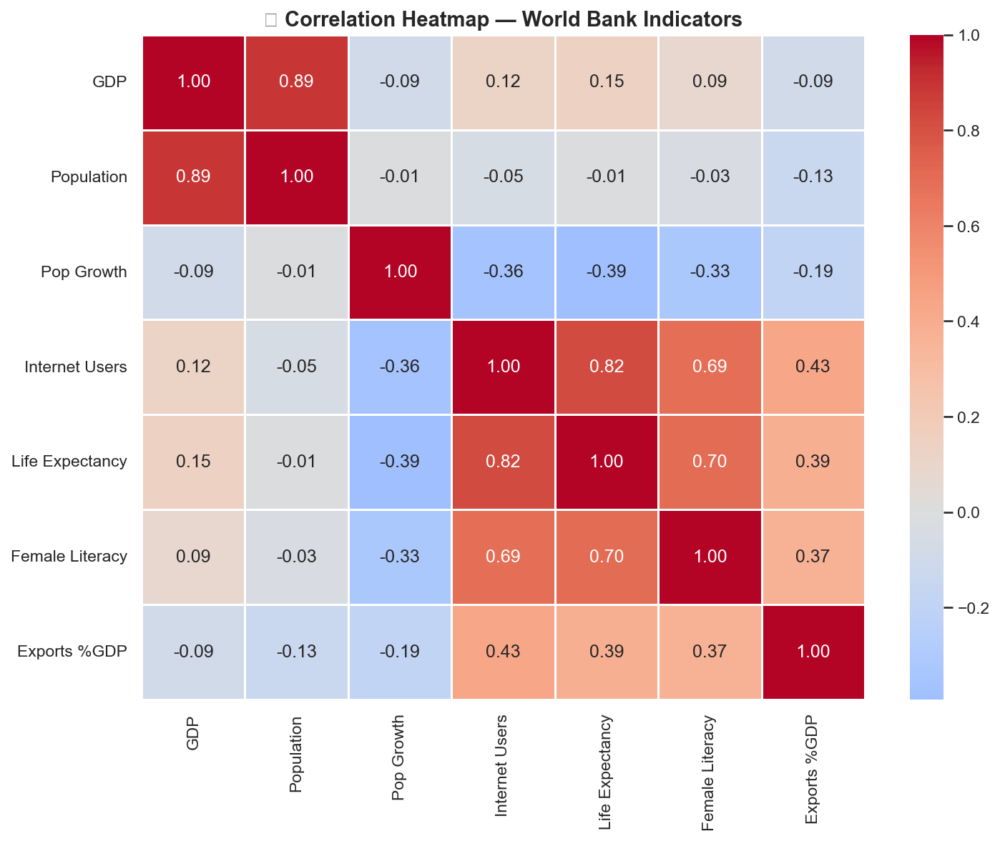

# 🌍 World Bank 2015 — Global Development Analysis

A data analysis project exploring the 2015 World Bank dataset covering 264 countries across key development indicators including GDP, internet access, life expectancy, female literacy, population, and exports.

---

## 📁 Project Structure

```
world-bank-analysis/
│
├── data/
│   └── 2015 World Bank data by nation and region.xls
│
├── images/
│   ├── missing_data.png
│   ├── gdp_by_region.png
│   ├── gdp_vs_internet.png
│   ├── life_expectancy_region.png
│   ├── female_literacy_bottom15.png
│   ├── population_vs_internet.png
│   ├── exports_by_region.png
│   └── correlation_heatmap.png
│
├── notebooks/
│   └── world_bank_analysis.ipynb
│
└── README.md
```

---

## 📌 Project Overview

This project analyzes the 2015 World Bank dataset to answer 7 key development questions across 264 countries and multiple world regions.

**Dataset contains:**
- 264 countries
- 11 development indicators
- Data grouped by country and world region

---

## ❓ Key Questions Answered

1. 🌍 Which regions have the highest and lowest GDP?
2. 💻 Is there a relationship between GDP and Internet usage?
3. ❤️ How does Life Expectancy vary across regions?
4. 📚 Which countries have the lowest female literacy rates?
5. 👥 How do the most populous countries compare on internet access?
6. 📦 Which regions lead in Exports as % of GDP?
7. 🇮🇳 Where does India stand globally across all indicators?

---

## 📊 Visualizations

### GDP by Region


### GDP vs Internet Usage


### Life Expectancy by Region


### Female Literacy — Bottom 15 Countries


### Top 10 Populous Countries vs Internet Access


### Exports by Region


### Correlation Heatmap


---

## 🛠️ Tools & Technologies

| Tool | Purpose |
|------|---------|
| Python | Core programming language |
| Pandas | Data manipulation and analysis |
| Matplotlib | Data visualization |
| Seaborn | Statistical data visualization |
| Jupyter Notebook | Interactive analysis environment |
| Excel (.xls) | Raw data storage |

---

## 🚀 Getting Started

### 1. Clone the repository
```bash
git clone https://github.com/dasanurag97-maker/world-bank-analysis.git
cd world-bank-analysis
```

### 2. Install dependencies
```bash
pip install pandas matplotlib seaborn openpyxl xlrd==1.2.0 jupyter
```

### 3. Run the notebook
- Open the project folder in **VS Code**
- Navigate to `notebooks/world_bank_analysis.ipynb`
- Click **"Run All"** to execute all cells

---

## 🔑 Key Findings

1. **GDP:** Europe and East Asia dominate global GDP. Sub-Saharan Africa has the lowest combined GDP despite having the largest population.
2. **Internet Access:** Strongly correlated with GDP — wealthier nations have significantly higher internet penetration rates.
3. **Life Expectancy:** North America and Europe average 75–85 years; Sub-Saharan Africa averages below 60 years.
4. **Female Literacy:** Several African and South Asian countries have critically low female literacy rates below 40%, indicating a major development gap.
5. **Exports:** Southeast Asia and Australasia are the most export-driven regions relative to their GDP.
6. **India 🇮🇳:** Ranks among the top 10 economies by GDP but lags in internet access and female literacy, showing significant untapped growth potential.

---

## 💡 Recommendations

1. **Invest in education** — Female literacy is the strongest lever for long-term economic growth in developing nations.
2. **Digital infrastructure** — Internet access shows a strong positive correlation with GDP and quality of life.
3. **Export-led growth** — Southeast Asia's export model has proven highly effective and could be adopted by other developing regions.

---

## 👤 Author

**Anurag Das**
[GitHub Profile](https://github.com/dasanurag97-maker)

---

## 📄 License

Copyright © 2026 dasanurag97-maker. All rights reserved.

This project and its contents are **strictly protected**. You may **NOT**:
- ❌ Copy or reproduce any part of this project
- ❌ Distribute or share this code
- ❌ Use this project commercially
- ❌ Submit this work as your own

This project is for **viewing purposes only**. Any unauthorized use is strictly prohibited.
